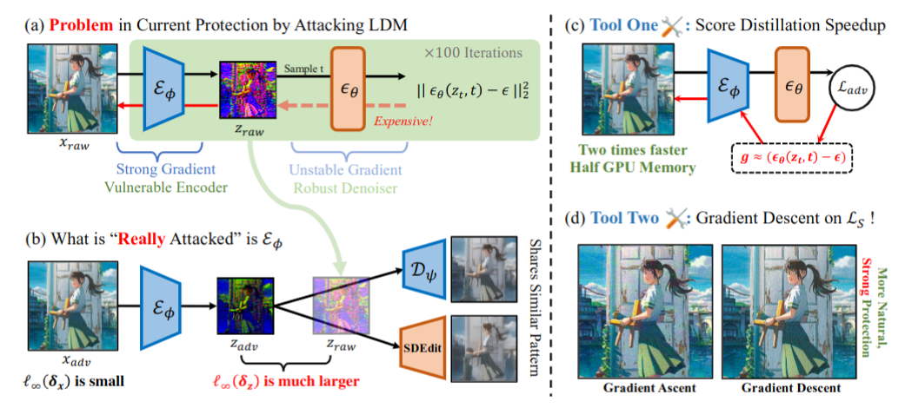

# Diff-Protect

面向扩散模型图像生成的对抗扰动防护框架。



## 概述

Diff-Protect 生成不可感知的对抗扰动，将其叠加到图像上后，可以破坏扩散模型的生成过程。本框架目前支持两个模型系列：

| 特性 | SD v1.4 (`diff_mist.py`) | SD 3.5 (`diff_mist_SD3.py`) |
|------|--------------------------|-----------------------------|
| 网络架构 | UNet + ε-预测 | MMDiT + v-预测 (Flow Matching) |
| 文本编码器 | CLIP × 1 | CLIP-L + CLIP-G + T5 |
| 注意力机制 | Cross-Attention | Joint Attention (双流) |
| 攻击损失 | 语义损失 / 纹理损失 / 联合损失 | 纹理损失 + 4 种 MMDiT 专用损失 |

---

## 快速配置

### SD v1.4 环境

```bash
conda env create -f env.yml
conda activate mist
pip install --force-reinstall pillow
```

下载 [Stable Diffusion v1.4 模型权重](https://huggingface.co/CompVis/stable-diffusion-v-1-4-original)：

```bash
wget -c https://huggingface.co/CompVis/stable-diffusion-v-1-4-original/resolve/main/sd-v1-4.ckpt
mkdir ckpt
mv sd-v1-4.ckpt ckpt/model.ckpt
```

### SD 3.5 环境

使用 `dino` conda 环境（需安装 PyTorch 2.0+ 及 modelscope）：

```bash
conda activate dino
# modelscope, diffusers, transformers, accelerate 应已预装
```

SD 3.5 模型权重从 ModelScope 加载（`stabilityai/stable-diffusion-3.5-medium`），使用本地缓存 `~/.cache/modelscope/hub/`，首次运行时自动下载。


## 运行防护

### SD v1.4 攻击

配置文件位于 `configs/attack/base.yaml`：

```yaml
attack:
    epsilon: 16           # L_inf 扰动预算（像素单位）
    steps: 100            # 攻击迭代次数
    input_size: 512       # 图像分辨率
    mode: sds             # 攻击模式
    img_path: test_images/to_protect
    output_path: out/
    alpha: 1              # 步长
    g_mode: "+"           # 梯度方向
    device: 0             # GPU 编号
```

可用模式：

| 模式 | 损失函数 | 命令 |
|------|----------|------|
| **AdvDM** | 仅语义损失 | `python code/diff_mist.py attack.mode='advdm' attack.g_mode='+' attack.device="cuda:2"` |
| **PhotoGuard** | 仅纹理损失 | `python code/diff_mist.py attack.mode='texture_only' attack.g_mode='+' attack.device="cuda:2"` |
| **Mist** | 纹理损失 + 语义损失（联合） | `python code/diff_mist.py attack.mode='mist' attack.g_mode='+' attack.device="cuda:2"` |
| **SDS(+)** | SDS 加速，梯度上升 | `python code/diff_mist.py attack.mode='sds' attack.g_mode='+' attack.device="cuda:2"` |
| **SDS(-)** | SDS 加速，梯度下降 | `python code/diff_mist.py attack.mode='sds' attack.g_mode='-' attack.device="cuda:2"` |
| **SDST(-)** | SDS + 目标纹理损失 | `python code/diff_mist.py attack.mode='sds' attack.g_mode='-' attack.using_target=True attack.device="cuda:2"` |

输出文件：
- `[NAME]_attacked.png` — 添加对抗扰动后的图像
- `[NAME]_onestep.png` — 单步去噪预测结果
- `[NAME]_multistep.png` — 多步 SDEdit 结果

   

*[从左到右]：AdvDM、Mist、SDS(-)，使用 eps=16。SDS 版本的效果明显优于前两种方法。*


### SD 3.5 MMDiT 攻击

配置文件位于 `configs/attack/base_sd3.yaml`：

```yaml
attack:
    epsilon: 16           # L_inf 扰动预算（像素单位）
    steps: 100            # 攻击迭代次数
    input_size: 1024      # 图像分辨率
    mode: A               # MMDiT 攻击模式：A/B/C/D
    img_path: test_images/to_protect
    output_path: out_sd3/
    alpha: 1              # 步长
    g_mode: "+"           # 梯度方向：'+' 或 '-'
    textual_weight: 1.0   # 纹理损失权重（VAE 潜空间推离）
    mmdit_weight: 1.0     # MMDiT 专用损失权重
    device: "cuda:2"      # GPU 设备
    model_name: "stabilityai/stable-diffusion-3.5-medium"  # ModelScope 模型 ID
```

#### MMDiT 攻击模式

联合损失遵循如下设计：**JOINT LOSS = TEXTUAL LOSS + λ · MMDiT LOSS**，其中 TEXTUAL LOSS 将 VAE 潜空间表示推向错误方向（与原始 Mist 相同），MMDiT LOSS 则利用 SD3 多模态 DiT 的架构特性进行攻击。

| 模式 | 名称 | 攻击目标 | 原理 |
|------|------|----------|------|
| **A** | 跨模态对齐破坏 | Joint Attention | 最大化 text→image 注意力权重的熵，使文本到图像的语义注入变得均匀/随机 |
| **B** | 注意力特征偏移 | MMDiT 中间层特征 | 最大化对抗样本与干净样本特征的余弦距离 + 破坏 Gram 矩阵（纹理/风格统计量） |
| **C** | 时序一致性破坏 | Flow Matching 轨迹 | 最大化对抗样本与干净样本速度预测（v-prediction）之间的夹角，使 ODE 去噪轨迹发散 |
| **D** | 模态不平衡 | 双流架构 | 强制图像流特征方差异常增大 + 强制跨模态投影（Q_img, K_txt）正交化，使 Joint Attention 融合产生"排异反应" |

#### 使用方式

```bash
# 模式 A：跨模态对齐破坏
python code/diff_mist_SD3.py attack.mode='A' attack.g_mode='+' attack.device="cuda:2"

# 模式 B：注意力特征偏移
python code/diff_mist_SD3.py attack.mode='B' attack.g_mode='+' attack.device="cuda:2"

# 模式 C：时序一致性破坏
python code/diff_mist_SD3.py attack.mode='C' attack.g_mode='+' attack.device="cuda:2"

# 模式 D：模态不平衡
python code/diff_mist_SD3.py attack.mode='D' attack.g_mode='+' attack.device="cuda:2"

# 调整损失权重：增大 MMDiT 损失权重，减小纹理损失权重
python code/diff_mist_SD3.py attack.mode='A' attack.textual_weight=0.5 attack.mmdit_weight=2.0 attack.device="cuda:2"

# 反向梯度方向
python code/diff_mist_SD3.py attack.mode='A' attack.g_mode='-' attack.device="cuda:1"
```

输出文件：
- `[NAME]_attacked.png` — 添加对抗扰动后的图像
- `[NAME]_sdedit_noise_0.1.png` — 噪声水平 0.1 的 SDEdit 去噪结果
- `[NAME]_sdedit_noise_0.3.png` — 噪声水平 0.3 的 SDEdit 去噪结果
- `[NAME]_sdedit_noise_0.5.png` — 噪声水平 0.5 的 SDEdit 去噪结果
- `[NAME]_loss.npy` — PGD 迭代过程中的损失曲线

## 项目结构

```
Diff-Protect/
├── code/
│   ├── diff_mist.py          # SD v1.4 攻击启动脚本
│   ├── diff_mist_SD3.py      # SD 3.5 MMDiT 攻击启动脚本
│   ├── attacks.py            # SD v1.4 PGD/SDS 攻击实现
│   ├── attacks_SD3.py        # SD 3.5 MMDiT 攻击 + 4 种损失函数
│   ├── utils.py              # 工具函数（图像读写、指标计算）
│   ├── eval_gen.py           # 生成质量评估
│   ├── eval.py               # 评估指标
│   ├── clip_similarity.py    # 基于 CLIP 的相似度
│   ├── inpaint.py            # 图像修复工具
│   ├── test_bench.py         # 测试基准
│   └── ldm/                  # 潜扩散模型（SD v1.4）
├── configs/
│   ├── attack/
│   │   ├── base.yaml         # SD v1.4 攻击配置
│   │   └── base_sd3.yaml     # SD 3.5 攻击配置
│   └── stable-diffusion/
│       └── v1-inference-attack.yaml
├── test_images/
│   ├── to_protect/           # 待保护图像
│   ├── target/               # 纹理损失的目标图像
│   └── media/                # README 素材
├── ckpt/                     # 模型权重（SD v1.4）
├── out/                      # SD v1.4 输出目录
├── out_sd3/                  # SD 3.5 输出目录
├── env.yml                   # Conda 环境配置（SD v1.4）
├── SD3对抗扰动设计.md         # SD3 对抗扰动设计文档
└── README.md
```


## 技术细节

### SD v1.4 损失函数

- **语义损失 (L_S)**：最大化去噪器的预测误差——将图像表示从扩散模型的语义空间中拉出。形式化：$\max_\delta \mathbb{E}_{t,\epsilon}[\|\epsilon - \epsilon_\theta(x_t', t)\|_2^2]$
- **纹理损失 (L_T)**：将图像在 VAE 潜空间中的表示推向错误目标方向。形式化：$\min_\delta \|\mathcal{E}(y) - \mathcal{E}(x+\delta)\|_2$
- **联合损失 (Mist)**：$\max_\delta (w \cdot L_S - L_T)$，以权重平衡因子联合优化两种损失。

### SD 3.5 MMDiT 损失函数

SD3 的 MMDiT 使用 Joint Attention，文本 token 和图像潜空间 token 拼接后共同进行自注意力计算，扰动可以在模态间传播。四种 MMDiT 损失分别利用该架构的不同特性：

1. **损失 A — 跨模态对齐破坏**：在 Joint Attention 中，text→image 注意力块（$\text{attn}[:N_i, N_i:]$）反映了语义注入强度。最大化其注意力熵使语义引导变得均匀/随机，导致生成结果偏离文本提示。

2. **损失 B — 注意力特征偏移**：Joint Attention 块输出的融合特征定义了图像在 MMDiT 特征流形中的表示。最大化对抗样本与干净样本特征之间的余弦距离（在高维 DiT 特征空间中方向比模长更重要，故选用余弦距离而非 L2），将表示推离干净流形。

3. **损失 C — 时序一致性破坏**：SD3 使用基于 Flow Matching 的 v-预测。通过最大化对抗样本与干净样本速度预测之间的夹角（$\min \cos(v_{adv}, v_{clean})$），使去噪轨迹发散，后续步骤的非线性将进一步放大扰动。

4. **损失 D — 模态不平衡**：MMDiT 拥有独立的文本流和图像流，仅在 Joint Attention 中交互。强制图像流特征的方差异常增大，同时将跨模态投影（Q_img, K_txt）推向正交，在联合融合中产生"排异反应"。
